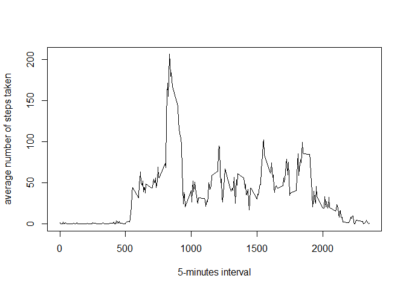
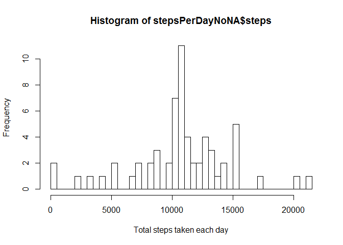
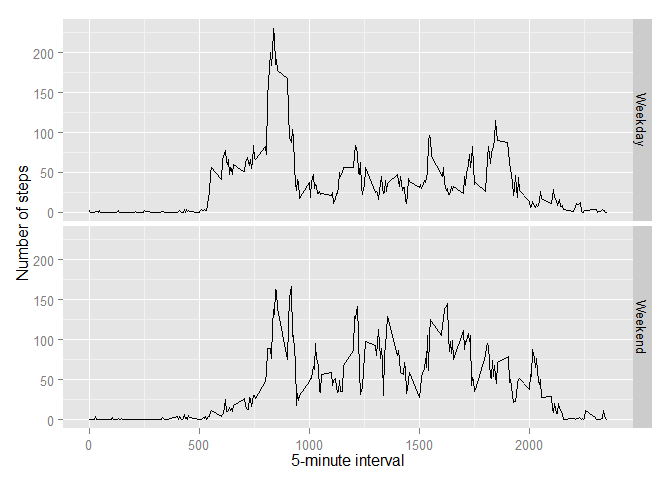

Processing the Data

``` {.r}
require(ggplot2)
```

    ## Loading required package: ggplot2

``` {.r}
data <- read.csv("activity.csv", header=TRUE, sep=",", colClasses = c("numeric","character","numeric"))
data$date <- as.Date(data$date, "%Y-%m-%d")
```

What is the total number of steps taken per day?

Aggregate steps per day:

``` {.r}
stepsPerDay <- aggregate(data$steps, by=list(data$date),FUN = sum, na.rm=TRUE)
colnames(stepsPerDay) <- c("date","steps")
hist(stepsPerDay$steps, breaks = 50, xlab="Total steps taken each day")
```


``` {.r}
mean(stepsPerDay$steps, na.rm=TRUE)
```

    ## [1] 9354.23

``` {.r}
median(stepsPerDay$steps, na.rm=TRUE)
```

    ## [1] 10395

What is the average daily activity Pattern?

``` {.r}
dailyAverage <- aggregate(data$steps, by=list(data$interval), FUN = mean, na.rm=TRUE)
colnames(dailyAverage) <- c("interval","steps")
plot(dailyAverage$interval, dailyAverage$steps, type = "l", xlab = "5-minutes interval", ylab ="average number of steps taken")
```



``` {.r}
dailyAverage[which.max(dailyAverage$steps),]
```

    ##     interval    steps
    ## 104      835 206.1698

Inputing Missing Values

First count the total number of missing values

``` {.r}
index <- which(is.na(data$steps))
length(index)
```

    ## [1] 2304

Create new data set using the mean for that 5-Minute Interval

``` {.r}
dataNoNA <- data
dataNoNA[index,1] <- dailyAverage[as.factor(dataNoNA[index,3]),2]
```

Aggregate Steps per Day

``` {.r}
stepsPerDayNoNA <- aggregate(dataNoNA$steps, by=list(dataNoNA$date),FUN = sum)
colnames(stepsPerDayNoNA) <- c("date","steps")
hist(stepsPerDayNoNA$steps, breaks = 50, xlab="Total steps taken each day")
```



``` {.r}
mean(stepsPerDay$steps, na.rm=TRUE)
```

    ## [1] 9354.23

``` {.r}
mean(stepsPerDayNoNA$steps)
```

    ## [1] 10766.19

``` {.r}
median(stepsPerDay$steps, na.rm=TRUE)
```

    ## [1] 10395

``` {.r}
median(stepsPerDayNoNA$steps)
```

    ## [1] 10766.19

Are there any diffirences in activity patterns during weekdays vs weekends?

``` {.r}
DayOfWeek <- function(date) {
  if (weekdays(date) %in% c('Saturday', 'Sunday')) {
    return('Weekend')
  } else {
    return('Weekday')
  }
}

dataNoNA$weekpart <- sapply(dataNoNA$date, DayOfWeek)
stepsWeekPart <- aggregate(dataNoNA$steps, by=list(dataNoNA$interval, dataNoNA$weekpart),FUN = mean)
colnames(stepsWeekPart) <- c("interval","weekpart","steps")

weekday <- ggplot(stepsWeekPart, aes(interval, steps)) + geom_line() + facet_grid(weekpart ~ .) +
  xlab("5-minute interval") + ylab("Number of steps")
plot(weekday)
```


